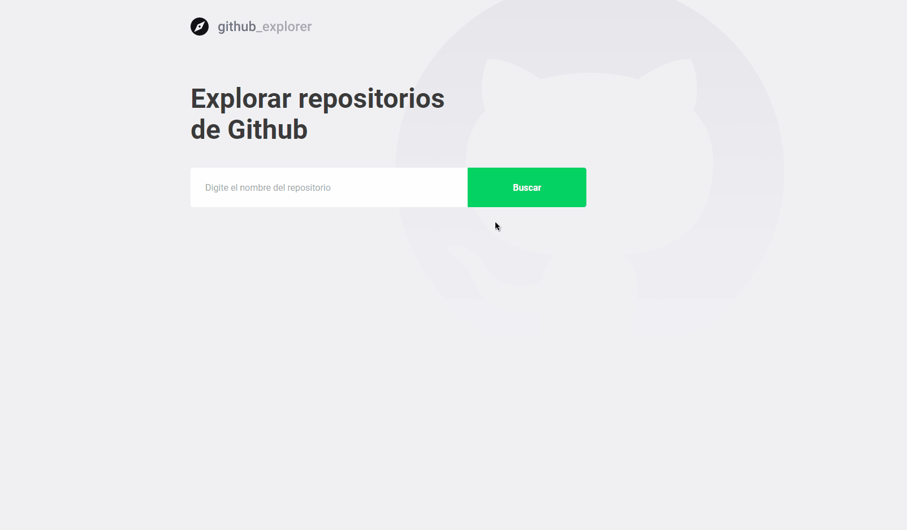

<h1 align="center">
 
  
 
 
Github Explorer
</h1>

An application that is in charge of searching for repositories, entering it and seeing the stars, forks and issues. They are stored in LocalStorage

  

[//]: # (Add your gifs/images here:)

  

## Features
[//]: # (Add the features of your project here:)
This app features all the latest tools and practices in mobile development!

- ⚛️ **React Js** — A JavaScript library for building user interfaces

## Getting started

1. Move yourself to the frontend folder: ``cd github_explorer``
2. Run ``yarn install`` to install dependencies
3. Run ``yarn start`` to start web application

## License

This project is licensed under the MIT License - see the [LICENSE](https://opensource.org/licenses/MIT) page for details.
